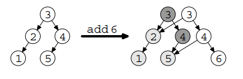

# Persistent-Data-Structures

Курсовой проект по дисциплине "Современные методы программирования" - "Persistent data structures"

## Разработчики: 
* *Карицкая Полина, 24225.1*
* *Пучков Дмитрий, 24225.1*

---
## Оглавление
- [Persistent-Data-Structures](#persistent-data-structures)
  - [Разработчики:](#разработчики)
  - [Оглавление](#оглавление)
  - [Описание задания](#описание-задания)
  - [Базовые требования](#базовые-требования)
  - [Дополнительные требования](#дополнительные-требования)
  - [Календарный план](#календарный-план)
  - [Ожидаемое решение](#ожидаемое-решение)
  - [Теоретическая часть](#теоретическая-часть)
    - [Персистентные структуры данных](#персистентные-структуры-данных)
    - [Fat node](#fat-node)
    - [Path copying](#path-copying)
    - [Более эффективное по скорости доступа представление структур данных](#более-эффективное-по-скорости-доступа-представление-структур-данных)
  - [API](#api)
  - [Примеры использования](#примеры-использования)
    - [Массив (Persistent Array)](#массив-persistent-array)
    - [Двусвязный список (Persistent Linked List)](#двусвязный-список-persistent-linked-list)
    - [Ассоциативный массив (Persistent Map)](#ассоциативный-массив-persistent-map)
  - [Используемые источники](#используемые-источники)

---
## Описание задания

Реализовать библиотеку в Python со структурами данных в persistent-вариантах.

---
## Базовые требования
- [ ] Массив (константное время доступа, переменная длина)
- [ ] Двусвязный список
- [ ] Ассоциативный массив (на основе Hash-таблицы, либо бинарного дерева)

---
## Дополнительные требования
- [ ] Обеспечить произвольную вложенность данных (по аналогии с динамическими языками), не отказываясь при этом
  полностью от типизации посредством generic/template;
- [ ] Реализовать универсальный undo-redo механизм для перечисленных структур с поддержкой каскадности (для вложенных
  структур);
- [ ] Реализовать более эффективное по скорости доступа представление структур данных, чем fat-node.

---
## Календарный план

| **Сроки**          | **Этап работы**                                                                 | **Разделение ответственностей**                                                                                              |
|--------------------|----------------------------------------------------------------------------------|-----------------------------------------------------------------------------------------------------------------------------|
| **до 23.11.2024**  | - Создание каркаса проекта <br> - Создание репозитория на GitHub                 | - Ответственный за настройку проекта и репозитория: *Полина* <br> - Ответственный за организацию структуры файлов и начальную настройку CI/CD: *совместно* |
| **до 07.12.2024**  | **Реализация базовой функциональности:** <br> - Массив (Persistent Array) <br> - Двусвязный список (Persistent Linked List) <br> - Ассоциативный массив (Persistent Map) <br> - Создание единого API | - Ответственный за реализацию Persistent Array: *_* <br> - Ответственный за реализацию Persistent Linked List: *Полина* <br> - Ответственный за реализацию Persistent Map: *Дмитрий* <br> - Ответственный за создание API: *совместно* |
| **до 21.12.2024**  | **Реализация дополнительной функциональности:** <br> - Реализовать более эффективное по скорости доступа представление структур данных, чем fat-node <br> - Обеспечить произвольную вложенность данных (по аналогии с динамическими языками) <br> - Реализовать универсальный undo-redo механизм для перечисленных структур с поддержкой каскадности | - Ответственный за улучшение представления структур данных: *совместно* <br> - Ответственный за реализацию вложенности данных: *совместно* <br> - Ответственный за разработку механизма undo-redo: *совместно* |

---
## Ожидаемое решение

Ожидаемое решение состоит в разработке библиотеки, которая будет поддерживать следующие структуры данных:

1. **Persistent Array** - массив с возможностью добавления элементов без изменения предыдущих состояний. Операции должны поддерживать константное время доступа.
   
2. **Persistent Linked List** - двусвязный список с поддержкой добавления и удаления элементов, при этом сохраняется возможность обратиться к предыдущим состояниям списка.

3. **Persistent Map** - ассоциативный массив, реализованный на основе хеш-таблицы или бинарного дерева поиска. Это будет позволять эффективно работать с данными, при этом поддерживать возможность обращения к предыдущим версиям данных.

4. **Оптимизация доступа к данным** - предложим более эффективное представление данных для ускорения операций доступа по сравнению с fat-node.

5. **Типизация данных** - обеспечим произвольную вложенность данных, при этом не отказываясь от строгой типизации через generic или template.

6. **Undo/Redo Механизм** - реализуем механизм для всех структур данных, который позволит отменять и повторять изменения, причем для вложенных структур будет поддерживаться каскадность.


Каждая из структур данных будет поддерживать все основные операции: вставку, удаление, обновление, поиск, а также предоставлять возможность работы с предыдущими версиями данных через устойчивость (persistent) данных. Вся библиотека будет иметь единый API для работы с данными и их модификацией. Также будет обеспечена возможность взаимодействия с данными в виде вложенных структур.

---
## Теоретическая часть

### Персистентные структуры данных

**Персистентные структуры данных** сохраняют предыдущие версии при изменении. Структура называется *fully persistent*, если все её версии доступны для изменений. В *partially persistent* структурах можно изменять только последнюю версию, но доступ к предыдущим возможен. Эти структуры часто реализуются с использованием алгоритмов, таких как path copying, node copying и fat node, а также с применением бинарных деревьев поиска и красно-черных деревьев.

Персистентные структуры используются в вычислительной геометрии, объектно-ориентированном программировании, текстовых редакторах, симуляциях и системах контроля версий, таких как Git.

### Fat node

*Fat node* используется для создания персистентных структур данных, где изменения сохраняются только в измененных узлах дерева, а сами узлы могут расширяться, чтобы хранить все версии. Основной принцип заключается в том, чтобы хранить обновления и версии данных в списках, что позволяет эффективно отслеживать изменения в структуре.

**Преимущества:**

* Экономия памяти, так как изменяются только те части данных, которые действительно изменились;
* Быстрая работа с историей изменений.

**Недостатки:**

* Может быть менее эффективен для структур с частыми изменениями, так как увеличение размера узлов приводит к дополнительным затратам на память.

Можно посмотреть [визуализацию метода *fat node*](https://kumom.io/persistent-bst).

### Path copying

Метод *path copying* используется для создания персистентных структур данных, где при изменении узла создается его копия, и нужно пройти по всем узлам от измененного до корня, чтобы обновить ссылки на новый узел. Этот метод упрощает доступ к данным, так как для поиска нужной версии достаточно пройти путь от корня.

**Преимущества:**

* Быстрый доступ к данным;
* Простота в реализации.

**Недостатки:**

* Большие затраты на память, поскольку изменения могут потребовать копирования всей структуры;
* Могут возникать дополнительные накладные расходы при частых модификациях.

Метод *path copying* также используется для создания полностью персистентных структур данных.

На иллюстрации продеминстрирован пример использования *path copying* на бинарном дереве поиска. При внесении изменения создается новый корень, при этом старый корень сохраняется для дальнейшего использования (он показан темно-серым цветом). Заметим также, что старое и новое деревья частично делят общую структуру.



### Более эффективное по скорости доступа представление структур данных

Поскольку одно из требований — использование более эффективного подхода по сравнению с методом *fat-node*, в проекте будет применяться метод *path copying*, совмещённая с использованием структуры B-деревьев для улучшения производительности.

---
## API

Для работы с персистентными структурами данных используйте следующий API:

Создание объекта:
```python
obj = [PersistentDataStructure]([args])
```

Обращение к элементу текщей версии:
```python
obj[index]
```

Обращение к элементу произвольной версии:
```python
obj.get(version, index)
```

Добавление элемента в новую версию:
```python
obj.add(element)
```

Удаление элемента в новой версии и возвращение элемента:
```python
obj.pop(index)
```

Обновление элемента в новой версии:
```python
obj[index] = element
```

Вставка элемента в новую версию:
```python
obj.insert(index, element)
```

Удаление элемента в новой версии:
```python
obj.remove(index)
```

Возвращение количества элементов в текущей версии:
```python
obj.size()
```

Проверка на пустоту:
```python
obj.check_is_empty()
```

Проверка на полноту:
```python
obj.check_is_full()
```

Возвращение состояние объекта для указанной версии:
```python
obj.get_version(version)
```

Обновление текущей версии объекта до указанной:
```python
obj.update_version(version)
```

---
## Примеры использования

### Массив (Persistent Array)


### Двусвязный список (Persistent Linked List)

**Пример использования класса PersistentLinkedList:**

Создание персистентного двусвязного списка:
```python
plist = PersistentLinkedList(max_size=5)
```

Добавление элементов
```python
plist.add(1)
plist.add(2)
plist.add(3)
```

Просмотр текущей версии списка
```python
print("Текущий список:", plist._get_current_state())  
```

```console
Текущий список: [1, 2, 3]
```

Удаление элемента и просмотр текущей версии списка
```python
plist.remove(1) 
print("Список после удаления:", plist._get_current_state())  
```

```console
Список после удаления: [1, 3]
```

Добавление элемента и просмотр текущей версии списка
```python
plist.add(4)
print("Список после добавления:", plist._get_current_state()) 
```

```console
Список после добавления: [1, 3, 4]
```

Получение доступа к истории версий
```python
print("Вторая версия списка:", plist.get_version(2))  
print("Третья версия списка:", plist.get_version(3))
```

```console
Вторая версия списка: [1, 2, 3]
Третья версия списка: [1, 3]
```

Обновление текущей версии до первой
```python
plist.update_version(1)
print("Список после обновления до первой версии:", plist._get_current_state())  
```

```console
Список после обновления до первой версии: [1, 2]
```

**Использования класса PersistentLinkedListFatNode:**

Использование класса `PersistentLinkedListFatNode` аналогично `PersistentLinkedList`, основные отличия продемонстрированы в таблице. 

| **Характеристика**             | **PersistentDoublyLinkedListFatNode**                                                                 | **PersistentLinkedList**                                               |
|--------------------------------|-------------------------------------------------------------------------------------------------------|------------------------------------------------------------------------|
| **Структура узла**             | Использует класс `FatNode`, сохраняющий текущие данные и ссылки на соседние узлы.                     | Использует класс `Node`, без отдельного сохранения данных.             |
| **Механизм персистентности**   | Сохраняет полные копии узлов с новыми связями при каждой операции (похож на path copying).            | Использует подход клонирования всех узлов только для истории, напрямую добавляя новые узлы. |
| **Клонирование состояния**     | Реализовано через метод `_clone_state`, где создается полная копия связанного списка.                 | Полная копия состояния сохраняется в методе `save_to_history`, добавляющем новое состояние в `history`. |
| **Поддержка дополнительных методов** | Простая реализация базовых методов для манипуляции данными.                                           | Расширенный API: `clear`, `remove_first`, `remove_last`, индексация через `__getitem__` и `__setitem__`. |
| **Поддержка версий**           | Версии представлены в `history` как список копий списка.                                              | Версии также хранятся в `history`, но с меньшей детализацией узлов.    |
| **Скорость операций**          | Более затратная по времени из-за глубокого копирования всех узлов при изменении.                      | Менее затратная, так как только измененные узлы сохраняются в историю. |


### Ассоциативный массив (Persistent Map)

---
## Используемые источники

1. Milan Straka, "Functional Data Structures and Algorithms", Computer Science Institute of Charles University, Prague 2013

2. Крис Окасаки, "Чисто функциональные структуры данных", 2018

3. Статья на Geeks for geeks ["Persistent data structures"](https://www.geeksforgeeks.org/persistent-data-structures/)

4. Несколько статей по персистентным векторам: 

    * [Understanding Clojure's Persistent Vectors, pt. 1](https://hypirion.com/musings/understanding-persistent-vector-pt-1)
    * [Understanding Clojure's Persistent Vectors, pt. 2](https://hypirion.com/musings/understanding-persistent-vector-pt-2)
    * [Understanding Clojure's Persistent Vectors, pt. 3](https://hypirion.com/musings/understanding-persistent-vector-pt-3)

5. Driscoll J. R. et al. Making data structures persistent //Proceedings of the eighteenth annual ACM symposium on Theory of computing. – 1986. – С. 109-121.

6. Серия видео-лекций по персистентным структурам данных:

    * ["Visualizing Persistent Data Structures" by Dann Toliver](https://www.youtube.com/watch?v=2XH_q494U3U)
    * [Persistent Data Structures, MIT](https://www.youtube.com/watch?v=T0yzrZL1py0)