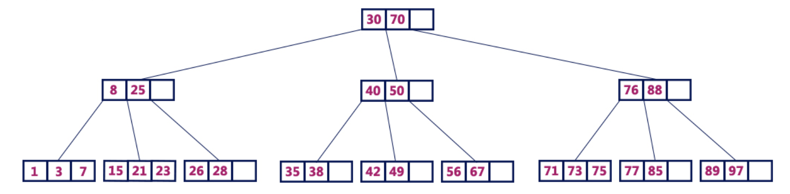

# Эффективность по памяти

Реализация дополнительного требования курсовой работы по дисциплине "Современные методы программирования" - "Persistent data structures"

---
## Оглавление
- [Эффективность по памяти](#эффективность-по-памяти)
  - [B-деревья](#B-деревья)
  - [Чем эффективнее простого копирования?](#чем-эффективнее-простого-копирования)
  - [Когда выгодно использовать B-деревья?](#когда-выгодно-использовать-B-деревья)
  - [Ограничения](#ограничения)

---
## B-деревья

**B-дерево(B-tree)** - сбалансированное дерево поиска, в котором каждый узел содержит множество ключей и имеет более двух потомков.

**B-дерево порядка m обладает следующими свойствами:**

*Свойство 1:* Глубина всех листьев одинакова.
*Свойство 2:* Все узлы, кроме корня должны иметь как минимум (m/2) – 1 ключей и максимум m-1 ключей.
*Свойство 3:* Все узлы без листьев, кроме корня (т.е. все внутренние узлы), должны иметь минимум m/2 потомков.
*Свойство 4:* Если корень – это узел не содержащий листьев, он должен иметь минимум 2 потомка.
*Свойство 5:* Узел без листьев с n-1 ключами должен иметь n потомков.
*Свойство 6:* Все ключи в узле должны располагаться в порядке возрастания их значений.

На иллюстрации продемонстрировано B-дерево 4 порядка. 

Представленная реализация с использованием B-деревьев позволяет сэкономить память по сравнению с простым копированием всей структуры данных для каждой новой версии. Экономия достигается за счет общего использования неизмененных данных, вместо создания полного дубликата при каждом изменении. 

---
## Чем эффективнее простого копирования?

1. Экономия памяти: 

    * При каждом обновлении создается копия только измененной части состояния, а неизмененные данные продолжают разделяться между версиями;
    * В простом копировании для каждой новой версии полностью дублируется все состояние, даже если изменения затрагивают лишь малую часть.

2. Скорость: 

    * Благодаря копированию только измененной части, создание новой версии работает быстрее, чем дублирование всего состояния.

3. Хранение данных: 

    * B-дерево позволяет организовать состояние версий так, что поддержка множества изменений становится управляемой и эффективной.

---
## Когда выгодно использовать B-деревья?

1. Частичные изменения состояния: 

    * Когда изменения касаются лишь небольшой части состояния, а остальное остается неизменным.

2. Множество версий: 

    * Если нужно поддерживать большое количество версий состояния.

---
## Ограничения

* Если изменения охватывают большую часть структуры данных (или всю), память перестает экономиться, поскольку почти весь массив нужно будет копировать.